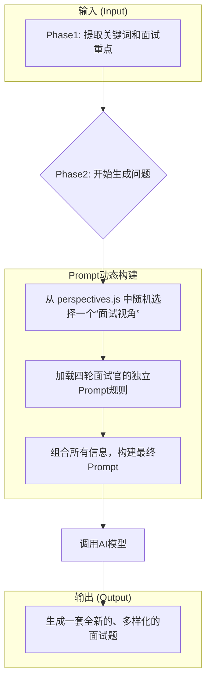

# Femock MCP: 架构与设计文档

## 1. 概述

`femock` 是一个面向前端开发者的、动态的模拟面试 MCP (Meta Command Palette) 工具。其核心目标是利用先进的提示词工程（Prompt Engineering）技术，为用户提供高质量、多样化且与个人背景高度相关的模拟面试体验。

## 2. 核心设计理念：模块化、动态化、可扩展

为了避免生成同质化、模板化的问题，`femock` 的架构摒弃了静态的、固定的Prompt模板，采用了一套**模块化、动态化**的Prompt生成机制。

其核心理念在于：

-   **关注点分离 (Separation of Concerns)**：将复杂的面试官逻辑拆解为独立的、可维护的Prompt模块。每个模块只负责一块特定的职责（如角色定义、考察规则、面试视角等）。
-   **动态组合 (Dynamic Composition)**：在运行时，根据上下文（简历、JD）和内置的随机化策略，将这些独立的Prompt模块动态地组合成一个最终的、高度结构化的指令。
-   **AI协作 (AI Collaboration)**：我们不期望AI凭空创造，而是通过精心设计的、结构化的指令来引导AI，使其扮演一个专业的面试官，从而生成高质量、符合预期的内容。

## 3. 动态问题生成的工作流程

`femock` 的问题生成主要发生在 `analyzeTaskPhase2` 工具的执行过程中，其内部工作流如下：



这个流程确保了即使输入完全相同，由于**随机视角**和**创造性指令**的存在，每次生成的问题组合都将是独一无二的。

## 4. 核心架构：`src/prompts` 目录

所有与Prompt工程相关的逻辑都集中在 `src/prompts` 目录下，这是 `femock` 的“大脑”。

```
src/prompts/
├── perspectives.js   # 动态面试视角库
├── phase1.js         # 第一阶段分析Prompt
├── phase2.js         # 第二阶段Prompt组合器
├── round1.js         # 技术同事面Prompt规则
├── round2.js         # 直属领导面Prompt规则
├── round3.js         # 总监架构师面Prompt规则
└── round4.js         # HR面Prompt规则
```

### 4.1 模块职责详解

-   **`perspectives.js`**:
    -   **职责**: 定义多个不同的“面试官风格”或“考察视角”（如深度优先、问题解决、工程素养等）。
    -   **功能**: 提供一个 `getRandomPerspective()` 函数，在每次任务执行时随机返回一个视角，这是实现“宏观多样性”的关键。

-   **`round[1-4].js`**:
    -   **职责**: 为每一轮面试官定义其独特的角色、任务和约束条件。
    -   **功能**: 每个文件导出一个 `getRound[N]Prompt()` 函数，返回一段结构化的文本，详细描述了该轮面试官的提问策略和侧重点。这确保了问题的专业性和角色感。

-   **`phase1.js`**:
    -   **职责**: 构建第一阶段分析的Prompt。
    -   **功能**: 接收简历和JD内容，生成一个用于提取关键词和各轮面试重点的Prompt。

-   **`phase2.js`**:
    -   **职责**: **核心组合器**。
    -   **功能**: 导入上述所有模块，执行以下操作：
        1.  调用 `getRandomPerspective()` 获取一个随机视角。
        2.  调用 `getRound[1-4]Prompt()` 获取四轮面试的规则。
        3.  将关键词、面试重点、随机视角、四轮规则以及鼓励创新的指令，组合成一个最终的、完整的Prompt。

## 5. 设计优势

1.  **高度可维护性**: 如果想调整第三轮面试官的风格，只需修改 `round3.js` 文件，而无需触及任何主逻辑。
2.  **易于扩展**: 增加新的“面试视角”只需在 `perspectives.js` 中添加一个新对象即可，极大地增强了系统的多样性。
3.  **高质量输出**: 通过专业的提示词工程设计（角色扮演、约束定义等），保证了AI生成内容的专业度和相关性。
4.  **保证多样性**: “随机视角”和“创造性指令”的双重机制，从根本上解决了重复生成相同问题的问题。

## 6. 未来展望

-   **视角权重**: 可以为不同的视角设置权重，或者根据JD的关键词动态调整不同视角的出现概率。
-   **知识库集成**: 当前预留了 `materialsSearch.js`，未来可以集成知识库，将检索到的相关知识点动态注入到Prompt中，进一步提升问题的深度。
-   **用户自定义Prompt**: 允许用户通过配置文件，覆盖或添加自己的面试官规则和视角。